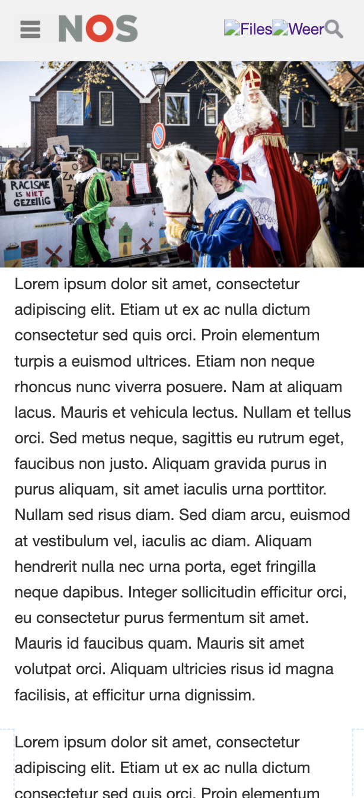
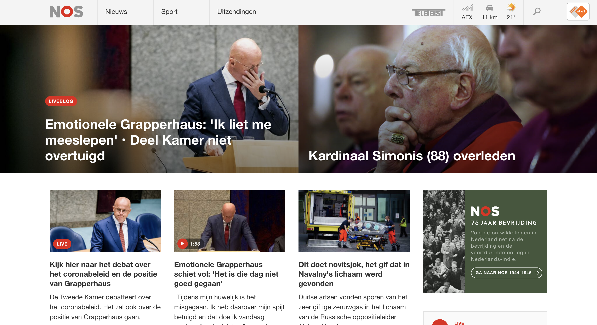
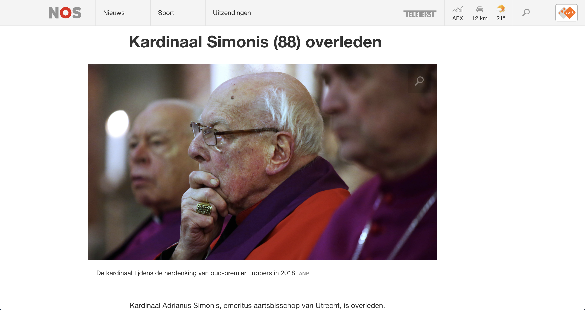
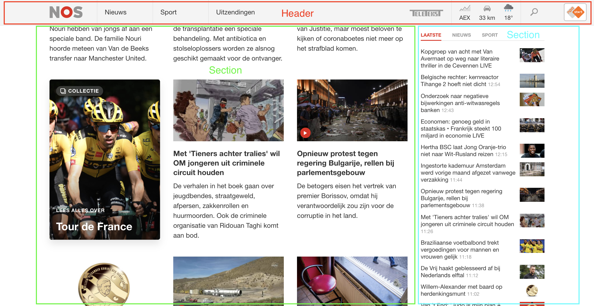
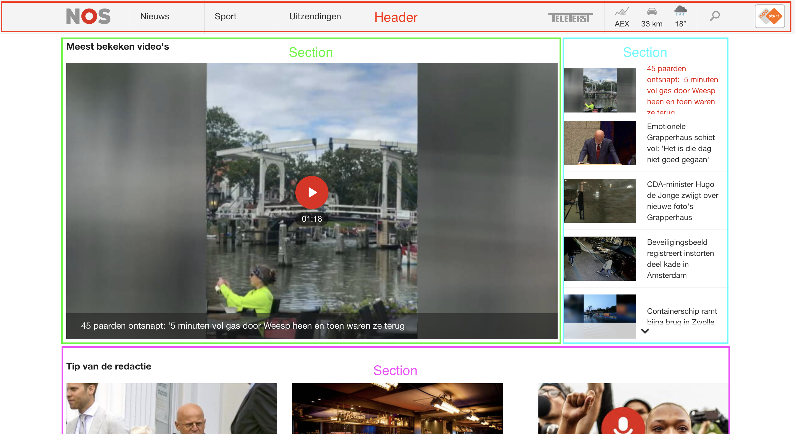

# Procesverslag
**Auteur:** Denzel Zegwaard.

Markdown cheat cheet: [Hulp bij het schrijven van Markdown](https://github.com/adam-p/markdown-here/wiki/Markdown-Cheatsheet). Nb. de standaardstructuur en de spartaanse opmaak zijn helemaal prima. Het gaat om de inhoud van je procesverslag. Besteedt de tijd voor pracht en praal aan je website.

## Bronnenlijst
1. -bron 1-
2. -bron 2-
3. -...-

## Eindgesprek (week 7/8)

-dit ging goed & dit was lastig-

**Screenshot(s):**

-screenshot(s) van je eindresultaat-

## Voortgang 3 (week 6)

-same as voortgang 1-

## Voortgang 2 (week 5)

-same as voortgang 1-

## Voortgang 1 (week 3)

### Stand van zaken

Wat ging er goed?
Totdat ik wat technische problemen met mijn laptop kreeg ging het erg goed met het responsive maken van mijn nav en het implementeren van de huisstijl van de.

Wat ging er niet goed?
Ik snap nog niet echt hoe je elementen laat inspringen na zoveel px of em. 
Hoe kan ik zorgen dat mijn menu button na zoveel pixels overspringt naar een nav met 3 links?
Ik weet nog niet zeker of ik alles semantisch correct codeer.

**Screenshot(s):**

### Agenda voor meeting

-samen met je groepje opstellen-

### Verslag van meeting

-na afloop snel uitkomsten vastleggen-

## Intake (week 1)

**Je startniveau:** Rood

**Je focus:** Mijn focus ligt op responsive

**Je opdracht:** Ik ga de https://nos.nl/ website na maken 

**Screenshot(s):**

**Breakdown-schets(en):**

