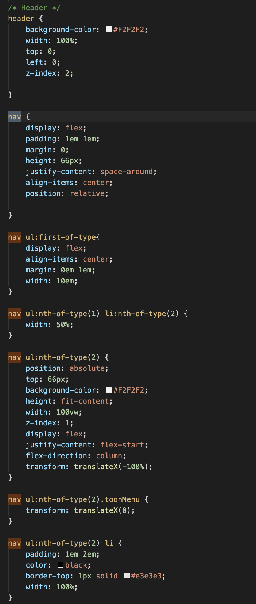
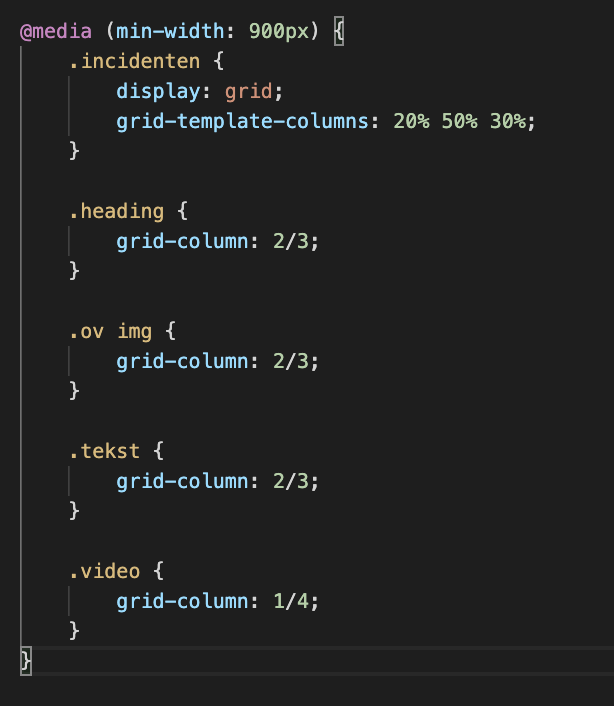

# Procesverslag
**Auteur:** Denzel Zegwaard.

Markdown cheat cheet: [Hulp bij het schrijven van Markdown](https://github.com/adam-p/markdown-here/wiki/Markdown-Cheatsheet). Nb. de standaardstructuur en de spartaanse opmaak zijn helemaal prima. Het gaat om de inhoud van je procesverslag. Besteedt de tijd voor pracht en praal aan je website.

## Bronnenlijst
1. https://www.youtube.com/watch?v=jx5jmI0UlXU - Learn CSS Position In 9 Minutes
2. https://www.youtube.com/watch?v=br-0i3U1VCA - Making Modern Layouts with CSS Grid | CSS Grid Basics
3. https://flexbox.io/ - flexbox clips
4. https://css-tricks.com/video-screencasts/150-hey-designers-know-one-thing-javascript-recommend/ - Javascripten
5. https://css-tricks.com/almanac/properties/b/background-size/ - ( :( )
6. https://www.youtube.com/watch?v=dIyVTjJAkLw - Hamburger menu
7. https://www.youtube.com/watch?v=F-mvXKKoSCU&t=34s - Hamburger menu 2
8. https://www.w3schools.com/tags/tag_i.asp
9. https://www.youtube.com/watch?v=l1mER1bV0N0
10.https://www.w3schools.com/tags/tag_select.asp
11.https://css-tricks.com/position-sticky-2/
12.https://developer.mozilla.org/en-US/docs/Web/CSS/cursor
13.https://www.bitdegree.org/learn/responsive-media - Learn how to use CSS Media Queries in less than 5 minutes
14.https://www.youtube.com/watch?v=uuOXPWCh-6o
15.https://www.youtube.com/watch?v=PwWHL3RyQgk - CSS GRID: Sizing Grid Items — 9 of 25

## Eindgesprek (week 7/8)
Wat ging er goed/
Ik ging veel sneller dan voorheen omdat ik nu meer sections gebruikte dan dat ik divs gebruikte, ik had ook fouten gemaakt in mijn html waardoor ik in mijn css in de problemen kwam, Dit kon ik na de eerste beoordeling gelukkig veranderen. Ik snap nu hoe ik een dropdown menu aanmaak en die vervolgens aanspreek in  mijn javascript. Ik ben na mijn 1ste beoordeling ook overgestapt naar Virtual Studio Code en Firefox inplaatst van Brackets en Chrome, dit maakte alles ook veel makkelijker en soepeler dan met brackets. 

Wat ging er niet goed?
Ik haal erg veel tijdnood en 2 dagen voor de deadline van de herkansing herschreef ik een leeg document over mijn index.html bestand heen waardoor ik weer helemaal opnieuw moest beginnen vanaf week 7. Ik had ook heel veel fout gedaan in mijn html pagina's die ik daarna moest verbeteren maar dit koste me erg veel tijd die ik niet had. 

**Screenshot(s):**
Nav

Heading (de bovenste twee artikelen)

Artikelen

Iframe

Grid

Footer

## Voortgang 3 (week 6)

Wat ging er goed/
Ik had deze week erg veel vooruitgang gemaakt met mijn code op gebied van grid en flexbox, Ik heb mijn grid en flexbox ingevuld tot de ene laatste breaking point. Vooral grid ligt mij nu goed, ik had in het begin ook erg veel last van flexbox maar die begrijp ik nu wel. 

Wat ging er niet goed?
Ik had deze week erg veel last van mijn nav en het coderen er van. Ik begreep niet echt veel van en ik snapte ook niet hoe ik een hamburger menu moet maken die naar beneden dropt. Ook merkte ik dat ik heel veel moeite had met het correct selecteren van mijn code in mijn css.

**Screenshot(s):**

## Voortgang 2 (week 5)

Wat ging er goed/
Alles gaat bij mij tot nu toe goed. ik ben klaar met mijn nav en mijn footer en ga nun beginnen aan de layout van de pagina en daarna ga ik mijn homepagina afmaken.

Wat ging er niet goed?
ik heb tot nu toe geen tot weinig problemen gehad met het afmaken van mijn project, als ik een probleem heb weet ik het zelf wel op te lossen.

Hulp bij:
- Ik zou graag nog wat meer willen weten over hoe ik vanaf 760px mijn burger menu hervorm met media queries naar 3 links in mijn nav.
- Ik zou graag meer wille weten over forms 
- Ik wil graag meer weten over Grid

Screenshots:

### Agenda voor meeting

1. Benthe 
2. Fleur 
3. Denzel
4. Jody
5. Arthur

## Voortgang 1 (week 3)

### Stand van zaken

Wat ging er goed?
Totdat ik wat technische problemen met mijn laptop kreeg ging het erg goed met het responsive maken van mijn nav en het implementeren van de huisstijl van de.

Wat ging er niet goed?
Ik snap nog niet echt hoe je elementen laat inspringen na zoveel px of em. 
Hoe kan ik zorgen dat mijn menu button na zoveel pixels overspringt naar een nav met 3 links?
Ik weet nog niet zeker of ik alles semantisch correct codeer.

**Screenshot(s):**

### Agenda voor meeting

1. Benthe 
2. Fleur 
3. Denzel
4. Jody
5. Arthur

### Verslag van meeting

-na afloop snel uitkomsten vastleggen-

## Intake (week 1)

**Je startniveau:** Rood

**Je focus:** Mijn focus ligt op responsive

**Je opdracht:** Ik ga de https://nos.nl/ website na maken 

**Screenshot(s):**

**Breakdown-schets(en):**

